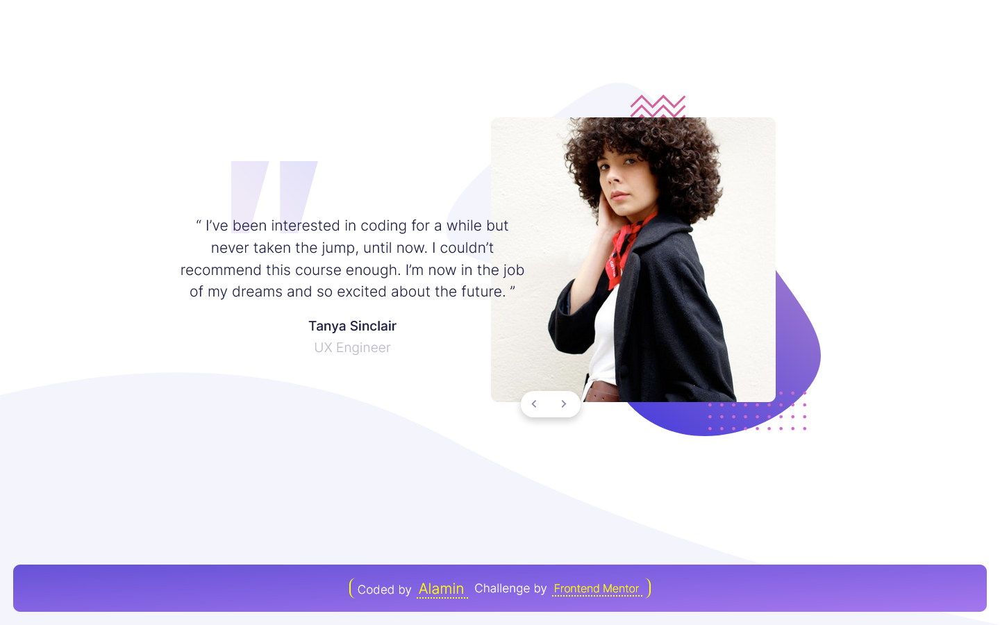

<h1 align="center">Coding bootcamp testimonials slider</h1>
<div align="center">

Challenge from [Frontend Mentor](https://www.frontendmentor.io/profile/CodePapa360)

</div>

<h2 align="center">

[🚀Live Site](https://coding-bootcamp-testimonials-codepapa.netlify.app/)
|
[💡Frontend Mentor]()

</h2>

<p align="center">
The "Coding Bootcamp Testimonials Slider" is a responsive web component developed for a Frontend Mentor project. This interactive slider showcases coding bootcamp testimonials using HTML, CSS, and JavaScript. Users can easily navigate through testimonials with smooth transitions and a visually appealing design. It demonstrates skills in responsive design, CSS styling, and JavaScript interactivity.
</p>

<a align="center" href="https://coding-bootcamp-testimonials-codepapa.netlify.app/">



</a>

## The challenge

Users should be able to:

- View the optimal layout for the component depending on their device's screen size
- Navigate the slider using either their mouse/trackpad or keyboard

## Built with

- Semantic HTML5 markup
- CSS custom properties
- CSS Grid
- JavaScript
- Mobile-first workflow
- NPM
- [Webpack - a module bundler](https://webpack.js.org/)

## What I learned

The "Coding Bootcamp Testimonials Slider" project provided me with an opportunity to apply and enhance my skills in CSS and JavaScript. By working on this project, I was able to demonstrate my proficiency in creating responsive layouts, implementing smooth transitions, and utilizing JavaScript for interactivity.

In terms of JavaScript, I leveraged its capabilities to handle user interactions and control the slider functionality. Through event listeners, I implemented navigation buttons and keyboard controls, enabling users to easily navigate through the testimonials. I also made use of DOM manipulation to dynamically update the slider's content and transition between slides smoothly.

Throughout the development process, I encountered challenges and successfully found solutions. For example, I effectively managed the timing of slide transitions by carefully coordinating the fade-out and fade-in effects using setTimeout().

By completing this project, I have further strengthened my skills in CSS and JavaScript, gaining hands-on experience in building interactive and dynamic components. It has provided me with valuable insights into creating engaging user experiences and utilizing advanced CSS and JavaScript techniques effectively.

I am proud of the outcome of this project and the opportunity it provided for me to showcase my skills and knowledge in front-end development.

## Installation

- Clone this repo:

```sh
git clone https://github.com/CodePapa360/Coding-bootcamp-testimonials-slider.git
```

- Install dependencies:

```sh
npm install
```

- Build command:

```sh
npm run build
```

- Live server:

```sh
npm start
```

## Author

<b>👤 Alamin</b>

- Twitter - [@CodePapa360](https://www.twitter.com/CodePapa360)
- LinkedIn - [@CodePapa360](https://www.linkedin.com/in/codepapa360)
- Frontend Mentor - [@CodePapa360](https://www.frontendmentor.io/profile/CodePapa360)
- Github: [@CodePapa360](https://github.com/codepapa360)

Feel free to contact me with any questions or feedback!

## Show your support

Give a ⭐️ if you liked this project!

## Acknowledgments

Special thanks to Frontend Mentor for providing such an amazing platform to practice and improve my frontend skills. The challenges and projects available on the website were both fun and challenging, and helped me learn a lot in a short amount of time.

## License

This project is licensed under the [MIT](https://github.com/CodePapa360/Coding-bootcamp-testimonials-slider/blob/main/LICENSE.md) license, which means you can use, modify, and distribute the code as you wish. If you have any questions or feedback, feel free to reach out. Thank you for considering my code!
